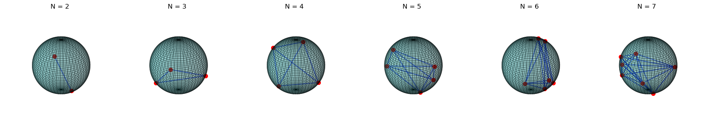

# Thomson Problem

## Description
The Thomson Problem involves finding the minimum energy configuration of particles constrained to the surface of a sphere. It is a variant of Smale's 7th problem "Distribution of points on the 2-sphere".

---



---

## Scope
- PyTorch implementation of gradient-based solution
- PyTorch implementation of normalizing flow solution
- Training and inference code (requires CUDA 11.8)
- Visualization of vector fields and elliptic Feteke points
- Approximate (polynomial time) algorithm for optimal initial point selection

---

## Installation
```bash
conda env create -f environment.yml
conda activate thomson
```
